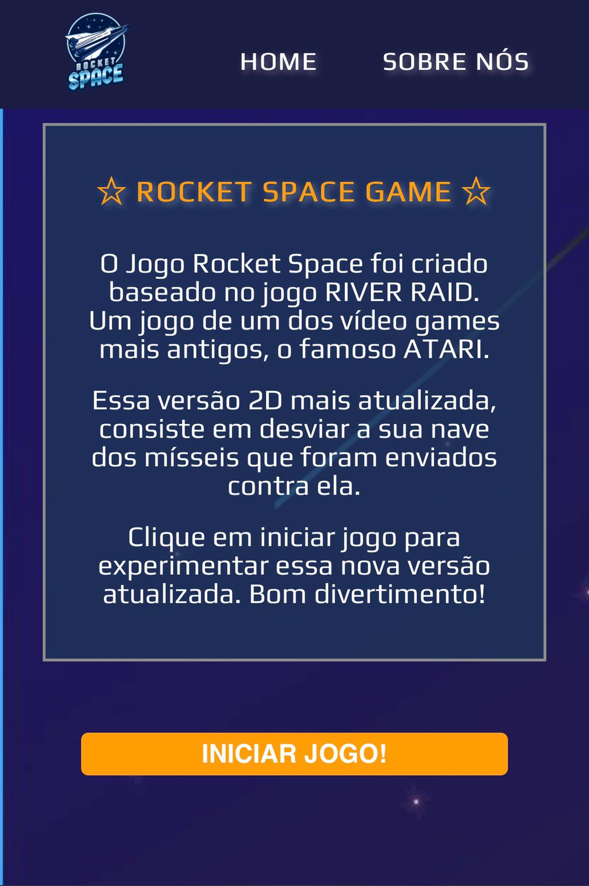
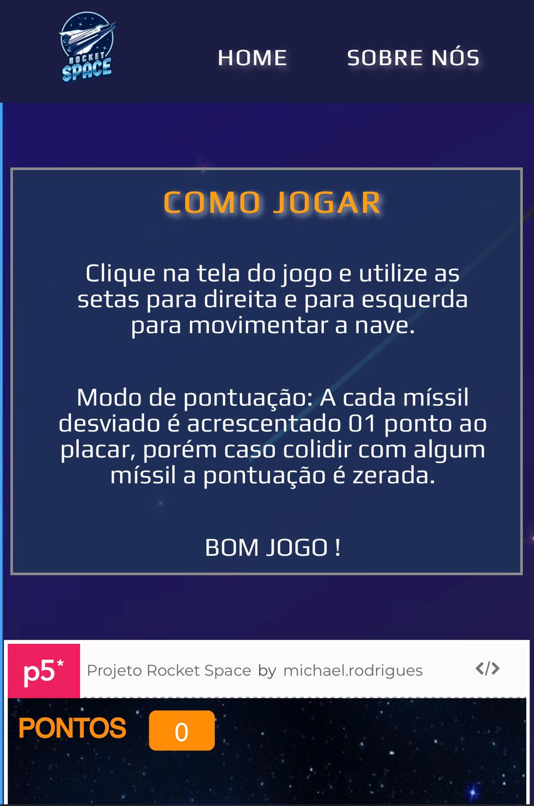
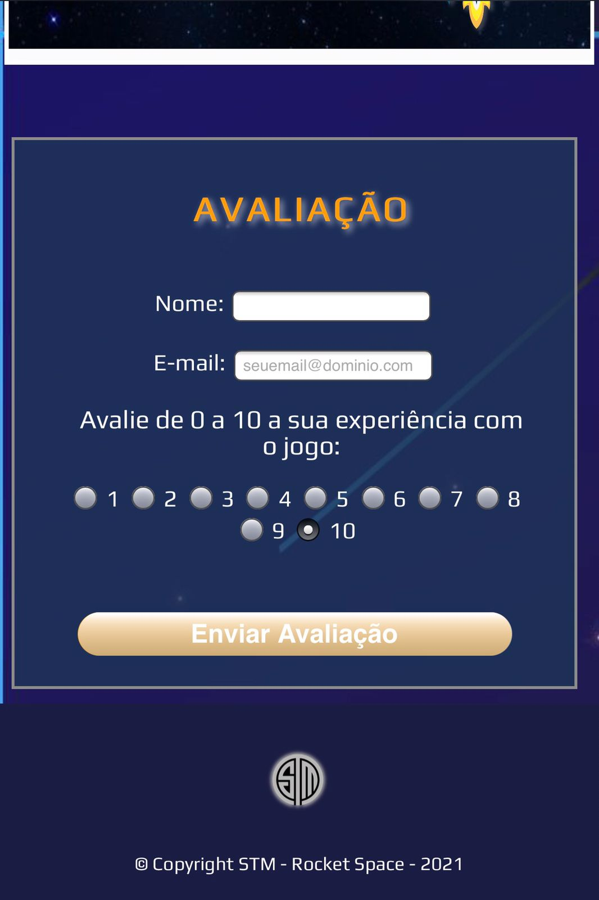

# Rocket Space Game - 2021

## Sobre o Projeto

https://michaelrrod.github.io/

Rocket Space game é uma aplicação web construída durante a 1ª Edição do **Projeto GoLogic**, evento organizado pela [Superlógica Tecnologias.](https://superlogica.com/ "Superlógica Tecnologias")

A aplicação foi baseada no jogo RIVER RAID, um jogo de um dos vídeo games mais antigos no Brasil, o famoso ATARI.
Essa versão 2D mais atualizada, consiste em desviar a sua nave dos mísseis que foram enviados contra ela, e para jogar basta utilizar as setas do teclado para direita e para esquerda.

Seu método de pontuação constiste em adicionar 01 ponto para cada míssil que atravessa a tela, e caso houver colisão **todos** os pontos serão perdidos e o jogo reiniciado.

Inserido também uma avaliação da experiência com o jogo onde essa avaliação vai de 0 a 10.
Basta preecher o nome e e-mail do usuário e enviar o formulário.

**Obs.:** O Formulário possui uma validação que se caso não preechindo algum campo obrigatório o formulário não é enviado.

## Layout Web
<h1>
  
   
  
</h1>

## Layout Mobile
<h1>
  
  
  
</h1>

## Tecnologias Utilizadas
- HTML
- CSS
- Java Script

# Autores

- Michael Rodrigues https://www.linkedin.com/in/michael-rodrigues-a3368811a/
- Ingrid Natsumi Braga https://www.linkedin.com/in/ingrid-natsumi-braga-67126a195/
- Santiago Ciocci https://www.linkedin.com/in/santiago-ciocci/

